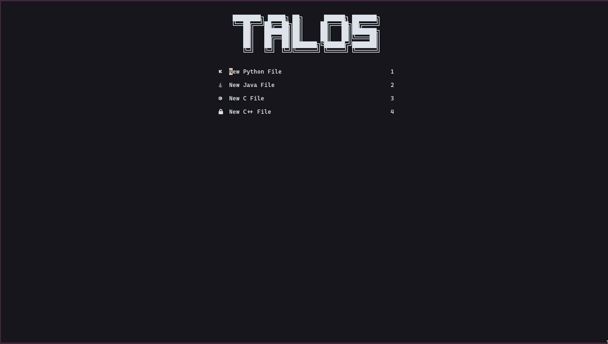
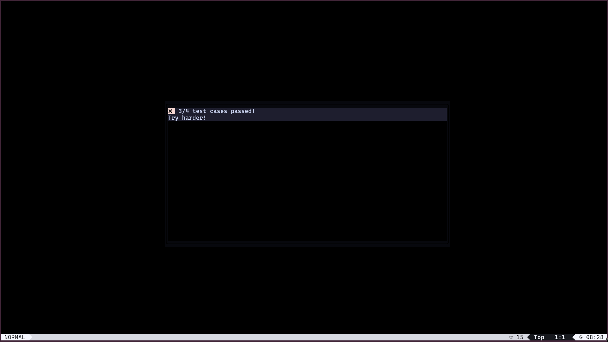

# LazyVim Blind Coding Configuration

## Overview

This is a custom LazyVim configuration designed for blind coding competitions or training purposes. The key feature of this setup is that users **cannot see the code they type**. However, when they press `Space + tt`, the code is executed, and the output is displayed.

## Features

- **Invisible Text:** The text typed by the user is hidden, forcing them to rely on their memory and understanding of syntax.

- Hide the expected output file in .skibidi folder 
    
- **Run Code with Space + tt:** Executes the current file and displays the output.
    
- **Supports Multiple Languages:** Works with Python, Java, C, and C++.
    
- **LazyVim-Based:** Built on top of LazyVim, making it highly customizable and extendable.
    

## Installation

### Prerequisites

- Neovim (>= 0.8)
    
- LazyVim installed
    
- Required compilers and interpreters (Python3, Java, GCC, G++)
    

### Steps

```
# Clone this configuration into your LazyVim setup
https://github.com/wizzseen/Blind-coding.git ~/.config/nvim

# Open Neovim and run
nvim
:Lazy sync

# Restart Neovim
```

## Usage

```
# Open a nvim 

# Choose a language 

# Press Space + tt to execute the code

# The output will be displayed in a floating window or below the code editor.
```

## Screenshot





## Configuration Details

```
-- The text is hidden using transparent highlighting
-- Key mapping for running code is configured via Lua
-- Integrated floating terminal for output
```

## Contributing

Feel free to fork and modify this setup for additional language support or enhancements.

## License

MIT License
